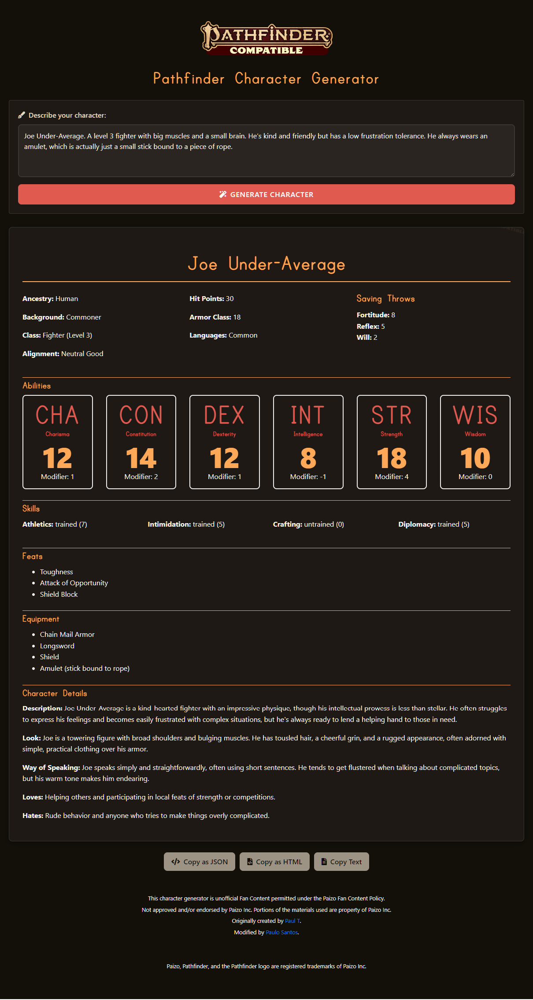

# AI-RPG-Character-Generator

<div style="display: flex; align-items: flex-start;">
<div style="flex: 1; padding-right: 20px;">

This project is a web-based application that generates character sheets for the Pathfinder 2nd Edition role-playing game. It uses OpenAI's GPT model to create detailed and creative character backgrounds, personalities, and statistics based on user prompts.

## Features

- Generate complete Pathfinder 2e character sheets from simple text prompts
- Web-based user interface for easy access and use
- Detailed character information including:
  - Basic details (name, ancestry, background, class, alignment)
  - Ability scores
  - Skills and proficiencies
  - Saving throws
  - Hit points and armor class
  - Feats and equipment
  - Character description, appearance, and personality traits
- Automatic calculation of ability modifiers
- Responsive design for use on various devices

</div>
<div style="flex: 1;">

</div>
</div>

## Installation

1. Clone this repository:
   ```
   git clone https://github.com/yourusername/AI-RPG-Character-Generator.git
   cd AI-RPG-Character-Generator
   ```

2. Create a virtual environment and activate it:
   ```
   python -m venv venv
   source venv/bin/activate  # On Windows, use `venv\Scripts\activate`
   ```

3. Install the required packages:
   ```
   pip install -r requirements.txt
   ```

4. Set up your OpenAI API key as an environment variable:
   ```
   export OPENAI_API_KEY='your-api-key-here'
   ```
   On Windows, use `set OPENAI_API_KEY=your-api-key-here`

## Usage

1. Start the Flask application:
   ```
   python app.py
   ```

2. Open a web browser and navigate to `http://localhost:5000`

3. Enter a character description in the text area and click "Generate Character"

4. Wait for the character generation process to complete

5. View your generated character sheet

## Project Structure

```
project_root/
│
├── app.py                 # Flask application
├── openai_client.py       # OpenAI API client
├── character_schema.py    # Pydantic models for character data
├── requirements.txt       # Project dependencies
├── Screenshot.png         # Application screenshot
│
└── templates/
    └── index.html         # HTML template for the web interface
```

## License

This project is licensed under the MIT License - see the [LICENSE](LICENSE) file for details.

## Acknowledgments

- OpenAI for providing the GPT model used in character generation
- The Pathfinder 2e community for inspiration and game mechanics

## Disclaimer

This project is not affiliated with or endorsed by Paizo Inc., the creators of Pathfinder. It is a fan-made tool intended for personal use and should not be used for commercial purposes.
